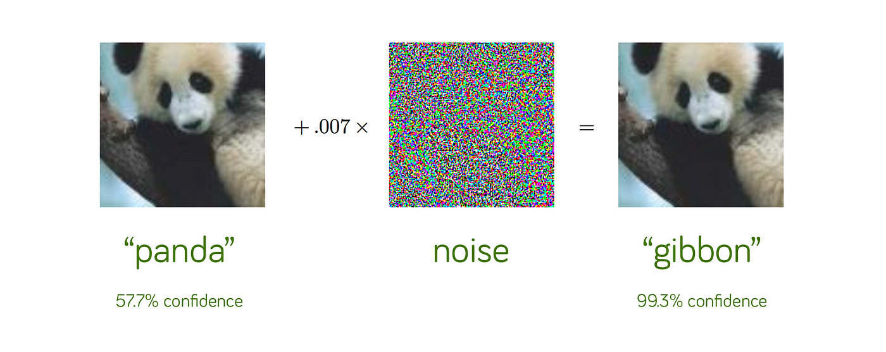

# 🛡️ Adversarial Training on CIFAR Dataset with ART Library



## Introduction

This repository demonstrates the implementation of adversarial training using the Adversarial Robustness Toolbox (ART). The project involves training a basic computer vision model on the CIFAR dataset, performing adversarial attacks, and retraining a more robust model to withstand these attacks. The resulting robust model successfully resists the adversarial examples.

Features

- Training a baseline computer vision model on the CIFAR dataset.
- Generating adversarial examples using ART.
- Retraining a model using adversarial training techniques to enhance robustness.
- Evaluation of the robust model against adversarial attacks.

## Prerequisites

### Python version

Python 3.8+

### Librairies

- Pytorch
- art (Adversarial Robustness Toolbox)
- scikit-learn
- numpy
- matplotlib

### Adversarial Robustness Toolbox
The [Adversarial Robustness Toolbox (ART)](https://github.com/Trusted-AI/adversarial-robustness-toolbox) is an open-source library developed by the Trusted AI team to help developers and researchers implement, evaluate, and defend machine learning models against adversarial attacks.

Key Features of ART
- Support for multiple machine learning frameworks, including TensorFlow, PyTorch, and Scikit-learn.
- Tools for generating adversarial examples using state-of-the-art attack methods (e.g., FGSM, PGD, DeepFool).
- Defense mechanisms, including adversarial training and preprocessing techniques.
- Utilities for benchmarking and evaluating model robustness against attacks.

### Dataset

CIFAR dataset (downloaded automatically via most deep learning libraries).

## Project Workflow

### 1. Train a Baseline Model

A simple model is trained on the CIFAR dataset to achieve a reasonable accuracy on clean data. This process is implemented in the train_basic_model.ipynb notebook.

### 2. Generate Adversarial Examples

Using the trained baseline model, adversarial examples are generated using ART. This process is implemented in the adversarial_attack.ipynb notebook.

### 3. Retrain with Adversarial Training

The baseline model is retrained using a mix of clean and adversarial examples to improve its robustness. This process is implemented in the train_robust_model.ipynb notebook.

### 4. Evaluate Robustness

The newly trained robust model is evaluated against the same adversarial attacks to verify its resistance in single_inference.ipynb. 

## Usage

1. Clone this repository:

```bash
git clone https://github.com/your-username/Computer-Vision-Adversarial-Training.git
cd Computer-Vision-Adversarial-Training
```

2. Install the librairies :

```bash
pip install -r requirements.txt
```

## Results

⚠️ **Disclaimer:** This project is a basic test of adversarial attacks and robustness improvements. It is not focused on achieving high model accuracy or extensive optimization.

### Test image
To test the two models, I simply made a prediction on a photo of a cat.


### Baseline Model:

Accuracy on clean data: 79.18%

Result on adversarial example: giraffe (true value: cat)

### Robust Model:

Accuracy on clean data: 52.00%

Accuracy on adversarial examples: cat (true value: cat

## Notes

- The robustness of the model depends on the attack method and its parameters. Fine-tuning these parameters may yield different results.
- Training time for adversarial training is typically longer due to the generation of adversarial examples.

## Acknowledgments

- Adversarial Robustness Toolbox (ART) : [ART](https://github.com/Trusted-AI/adversarial-robustness-toolbox)
- CIFAR Dataset : [CIFAR](https://www.cs.toronto.edu/~kriz/cifar.html)
